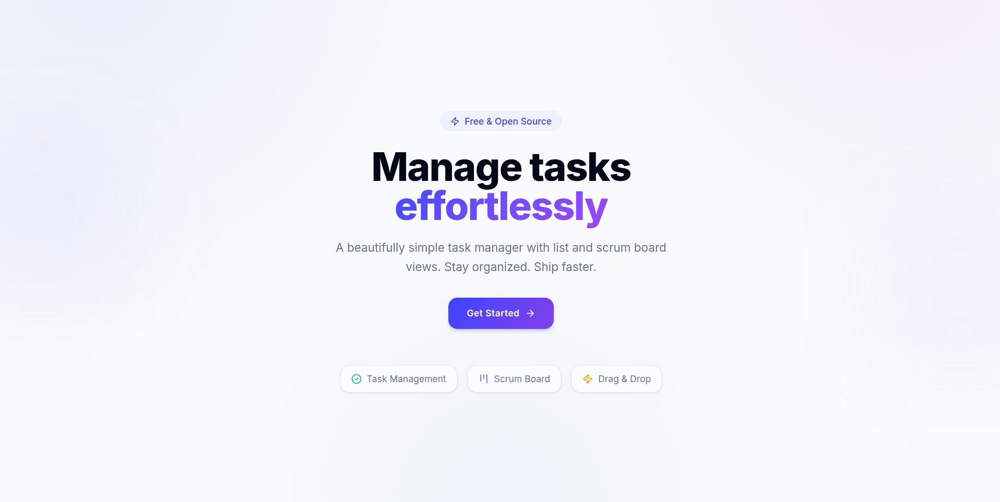
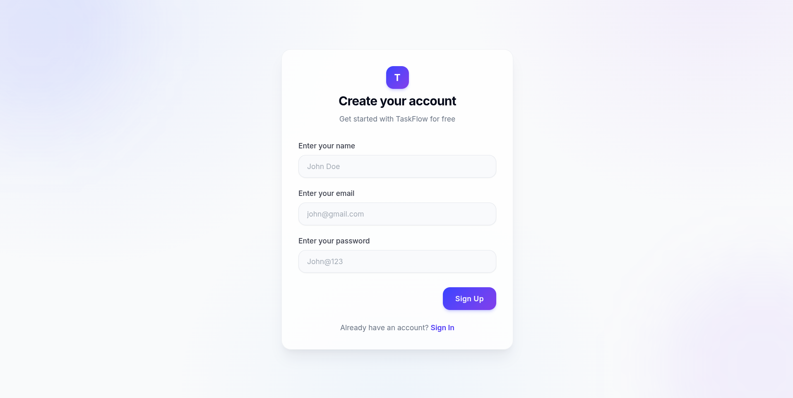
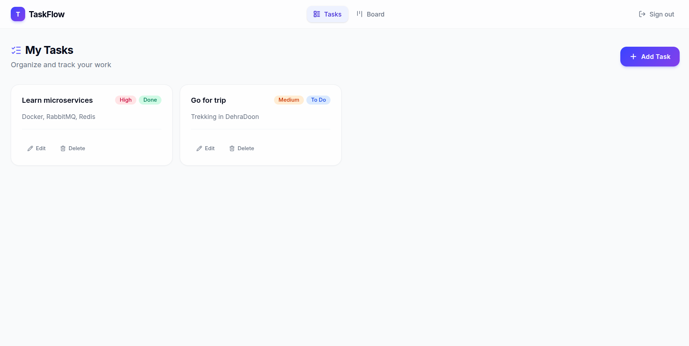
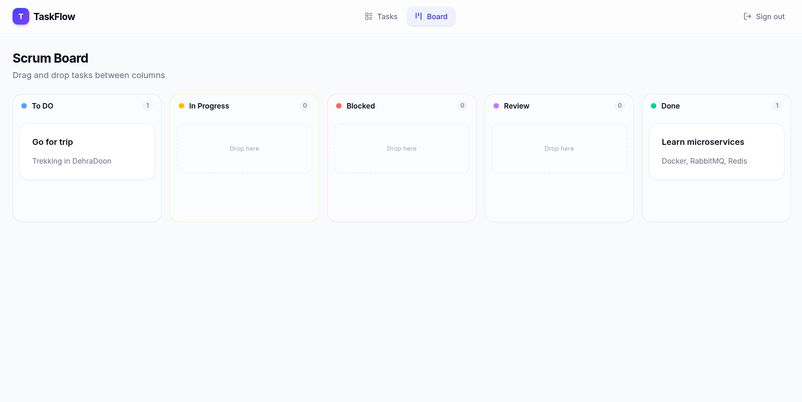

# 📋 Task Management Application

A full-stack task management application built with **React** and **Node.js**, following a **microservices architecture**. Features include user authentication, CRUD task operations, a Kanban-style scrum board, and real-time notifications via event-driven messaging.

---

## ✨ Features

- **User Authentication** — Register, login, logout with JWT-based cookie auth
- **Task Management** — Create, read, update, delete tasks
- **Scrum Board** — Kanban board with drag-and-drop (To Do → In Progress → Blocked → Review → Done)
- **Task Priorities** — Low, medium, high priority levels
- **Notifications** — Automatic notifications for task events (created, updated, deleted, status changed)
- **API Gateway** — Centralized routing, JWT verification, rate limiting
- **Event-Driven Architecture** — Services communicate through RabbitMQ message broker
- **Database per Service** — Each microservice owns its own MongoDB database

---

## 🏗️ Architecture

```
                   ┌────────────┐
                   │  Frontend  │
                   │  (React)   │
                   │  :5173     │
                   └──────┬─────┘
                          │
                   ┌──────▼──────────┐
                   │  API Gateway    │
                   │  :4000          │
                   │                 │
                   │ • JWT verify    │
                   │ • Rate limiting │
                   │ • Route proxy   │
                   └───────┬─────────┘
                           │
          ┌────────────────┼────────────────┐
          │                │                │
   ┌──────▼──────┐  ┌─────▼───────┐  ┌─────▼──────────┐
   │ User Service│  │ Task Service│  │ Notification   │
   │ :4001       │  │ :4002       │  │ Service :4003  │
   │             │  │             │  │                │
   │ user_db     │  │ task_db     │  │ notification_db│
   └──────┬──────┘  └──────┬──────┘  └────────▲───────┘
          │                │                   │
          │  user.events   │  task.events      │ Consumes
          └───────┬────────┘───────────────────┘
                  │
            ┌─────▼──────┐
            │  RabbitMQ   │
            │  :5672      │
            └─────────────┘
```

### How It Works

1. **Frontend** sends all requests to the **API Gateway** (`:4000`)
2. **Gateway** verifies JWT tokens from cookies, then proxies requests to the correct service
3. **User Service** handles auth (register, login, logout) and publishes `user.events` to RabbitMQ
4. **Task Service** handles CRUD operations and publishes `task.events` to RabbitMQ
5. **Notification Service** consumes events from both exchanges and stores notifications

---

## 📁 Project Structure

```
Task-Management-Application/
├── Client/                          # React Frontend (Vite)
│   ├── src/
│   │   ├── components/              # Reusable UI components
│   │   ├── config/                  # Form configs, scrum board options
│   │   ├── context/                 # Global state (React Context)
│   │   ├── pages/                   # Page components (Auth, Tasks, Scrum)
│   │   ├── services/                # API service layer (axios calls)
│   │   ├── App.jsx                  # Root component with routing
│   │   └── main.jsx                 # Entry point
│   └── package.json
│
├── services/                        # Microservices Backend
│   ├── api-gateway/                 # API Gateway (:4000)
│   │   └── src/
│   │       ├── config/
│   │       │   ├── proxy.js         # http-proxy-middleware setup
│   │       │   └── services.js      # Route → service mapping
│   │       ├── middleware/
│   │       │   ├── auth.js          # JWT verification middleware
│   │       │   └── rateLimiter.js   # Rate limiting
│   │       └── index.js             # Entry point
│   │
│   ├── user-service/                # User Service (:4001)
│   │   └── src/
│   │       ├── config/rabbitmq.js   # RabbitMQ connection
│   │       ├── controllers/         # Register, login, logout, auth
│   │       ├── database/database.js # MongoDB connection
│   │       ├── events/publisher.js  # Publishes user.events
│   │       ├── models/user.js       # User schema
│   │       ├── routes/              # Express routes
│   │       └── index.js             # Entry point
│   │
│   ├── task-service/                # Task Service (:4002)
│   │   └── src/
│   │       ├── config/rabbitmq.js   # RabbitMQ connection
│   │       ├── controllers/         # Add, get, update, delete tasks
│   │       ├── database/database.js # MongoDB connection
│   │       ├── events/publisher.js  # Publishes task.events
│   │       ├── models/task.js       # Task schema
│   │       ├── routes/              # Express routes
│   │       └── index.js             # Entry point
│   │
│   └── notification-service/        # Notification Service (:4003)
│       └── src/
│           ├── controllers/         # Get/mark notifications
│           ├── database/database.js # MongoDB connection
│           ├── events/
│           │   ├── consumer.js      # RabbitMQ consumer setup
│           │   └── handler.js       # Event processing logic
│           ├── models/notification.js
│           ├── routes/              # Express routes
│           └── index.js             # Entry point
│
├── docker-compose.yml               # Orchestrates all containers
└── .env                             # Environment variables
```

---

## 🛠️ Tech Stack

| Layer | Technology |
|-------|-----------|
| **Frontend** | React 18, Vite, React Router, Axios, Tailwind CSS, Shadcn/UI, Lucide Icons |
| **Backend** | Node.js, Express.js |
| **Database** | MongoDB (one per service) |
| **Message Broker** | RabbitMQ (topic exchanges) |
| **Auth** | JWT (httpOnly cookies) |
| **Gateway** | http-proxy-middleware |
| **Containerization** | Docker, Docker Compose |
| **Validation** | Joi |

---

## 🚀 Getting Started

### Prerequisites

- [Node.js](https://nodejs.org/) (v20+)
- [Docker Desktop](https://www.docker.com/products/docker-desktop/) (with Docker Compose)

### 1. Clone the Repository

```bash
git clone https://github.com/SayandipSaha666/Task-Management-Application.git
cd Task-Management-Application
```

### 2. Set Up Environment Variables

Create a `.env` file in the project root (next to `docker-compose.yml`):

```env
SECRET_KEY=your_jwt_secret_key_here
```

### 3. Start All Backend Services (Docker)

```bash
docker compose up --build
```

This starts **7 containers**:
| Container | Port | Description |
|-----------|------|-------------|
| `api-gateway` | 4000 | Entry point for all API requests |
| `user-service` | 4001 | User authentication |
| `task-service` | 4002 | Task CRUD operations |
| `notification-service` | 4003 | Event-driven notifications |
| `rabbitmq` | 5672, 15672 | Message broker (15672 = dashboard) |
| `mongo-user` | — | MongoDB for user data |
| `mongo-task` | — | MongoDB for task data |
| `mongo-notification` | — | MongoDB for notifications |

### 4. Start the Frontend

```bash
cd Client
npm install
npm run dev
```

Frontend runs at: **http://localhost:5173**

### 5. Verify Everything Works

- **Frontend**: http://localhost:5173
- **API Gateway**: http://localhost:4000/health
- **RabbitMQ Dashboard**: http://localhost:15672 (admin / password)

---

## 📡 API Endpoints

All requests go through the API Gateway at `http://localhost:4000`.

### User Service (`/api/user`)

| Method | Endpoint | Auth | Description |
|--------|----------|------|-------------|
| POST | `/api/user/register` | ❌ | Register a new user |
| POST | `/api/user/login` | ❌ | Login and receive JWT cookie |
| POST | `/api/user/auth` | ✅ | Verify authentication |
| POST | `/api/user/logout` | ✅ | Logout and clear cookie |

### Task Service (`/api/task`)

| Method | Endpoint | Auth | Description |
|--------|----------|------|-------------|
| POST | `/api/task/add` | ✅ | Create a new task |
| GET | `/api/task/all/:userId` | ✅ | Get all tasks for a user |
| PUT | `/api/task/update` | ✅ | Update a task |
| DELETE | `/api/task/delete/:id` | ✅ | Delete a task |

### Notification Service (`/api/notification`)

| Method | Endpoint | Auth | Description |
|--------|----------|------|-------------|
| GET | `/api/notification/:userId` | ✅ | Get all notifications |
| PATCH | `/api/notification/:id/read` | ✅ | Mark one as read |
| PATCH | `/api/notification/:userId/read-all` | ✅ | Mark all as read |

---

## 🐳 Docker Commands

```bash
# Start all services
docker compose up --build

# Start with hot-reload (file watching)
docker compose watch

# Start a specific service
docker compose up --build user-service

# Stop all services
docker compose down

# Stop and remove volumes (reset databases)
docker compose down -v

# View logs
docker compose logs -f api-gateway
```

---

## 📨 Event Flow (RabbitMQ)

Services communicate through RabbitMQ **topic exchanges**:

| Exchange | Routing Key | Published By | Consumed By |
|----------|-------------|--------------|-------------|
| `user.events` | `user.registered` | User Service | Notification Service |
| `user.events` | `user.loggedIn` | User Service | Notification Service |
| `user.events` | `user.loggedOut` | User Service | Notification Service |
| `task.events` | `task.created` | Task Service | Notification Service |
| `task.events` | `task.updated` | Task Service | Notification Service |
| `task.events` | `task.deleted` | Task Service | Notification Service |
| `task.events` | `task.statusChanged` | Task Service | Notification Service |

---

## 📸 Screenshots





---

## 🤝 Contributing

1. Fork the repository
2. Create a feature branch (`git checkout -b feature/amazing-feature`)
3. Commit your changes (`git commit -m 'Add amazing feature'`)
4. Push to the branch (`git push origin feature/amazing-feature`)
5. Open a Pull Request

---

## 📄 License

This project is open source and available under the [MIT License](LICENSE).
